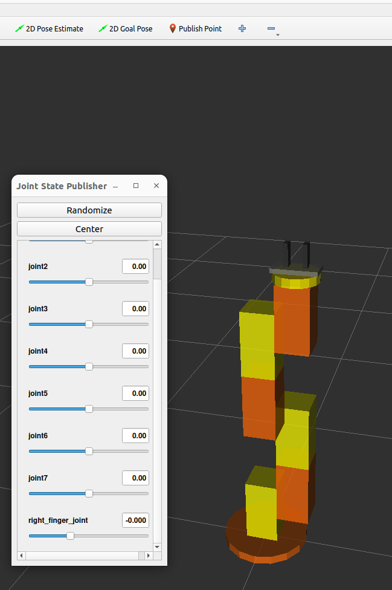
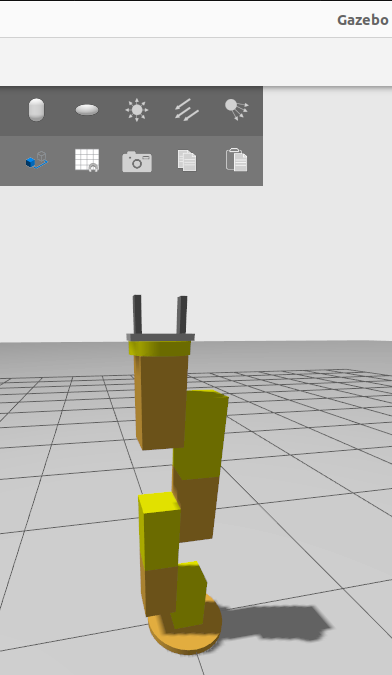

# Manipulators-ROS2-From-Forward-Kinematics-to-Advanced-Algorithms
The Github series provides a guide to working with any manipulators designed in CAD or manually created URDF and in ROS2 simulation, implementing from Forward Kinematics (FK) to complex motion planning and control algorithms. The equation and some concepts were implemented from the [Modern Robotics book](#https://hades.mech.northwestern.edu/index.php/Modern_Robotics).

### Milestones

- [x] [URDF and Rviz](#urdf-and-rviz)  
- [x] [Gazebo Ignition and ROS controls Integration](#gazebo)
- [x] Forward Kinematics (FK)
- [x] Velocity Kinematics [Jacobian], Singularity, manipulability and Static force
- [x] Inverse Kinematics (IK)
- [ ] Teleoperation with Multi-Threading
- [ ] Dynamics Equations
- [ ] Trajectory generation
- [ ] Impedance Control
- [ ] Admittance Control
- [ ] Motion Planning

  
### URDF and Rviz

  
  

  
### Gazebo Ignition and ROS controls Integration

  
  

